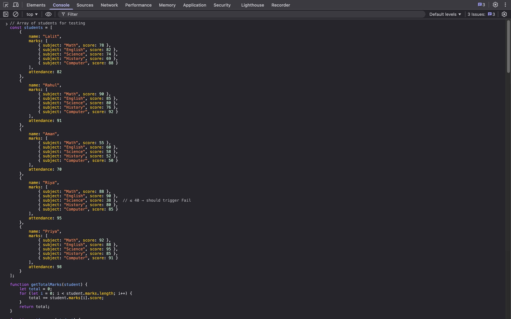
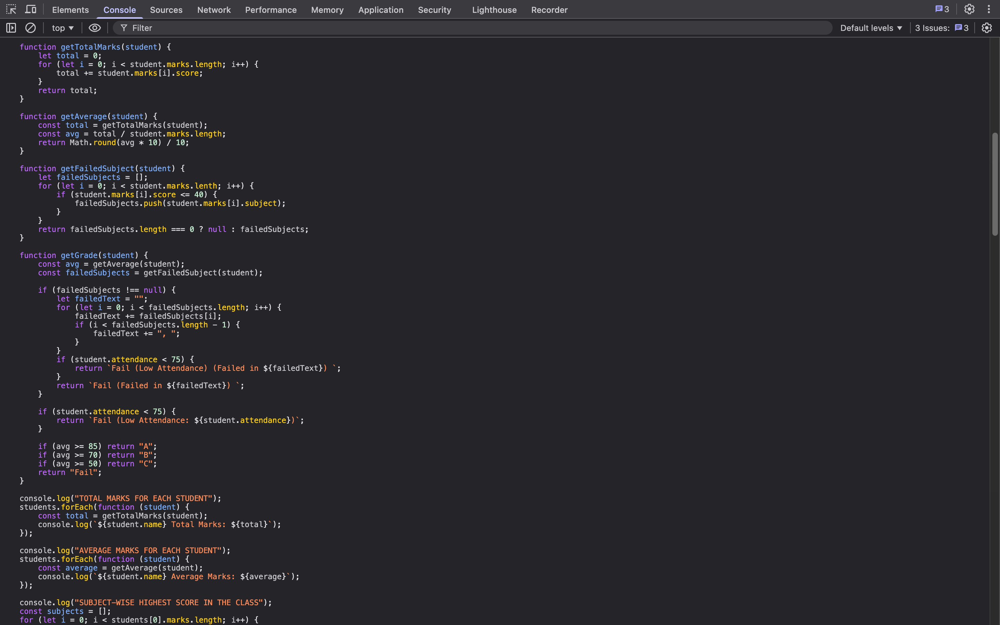
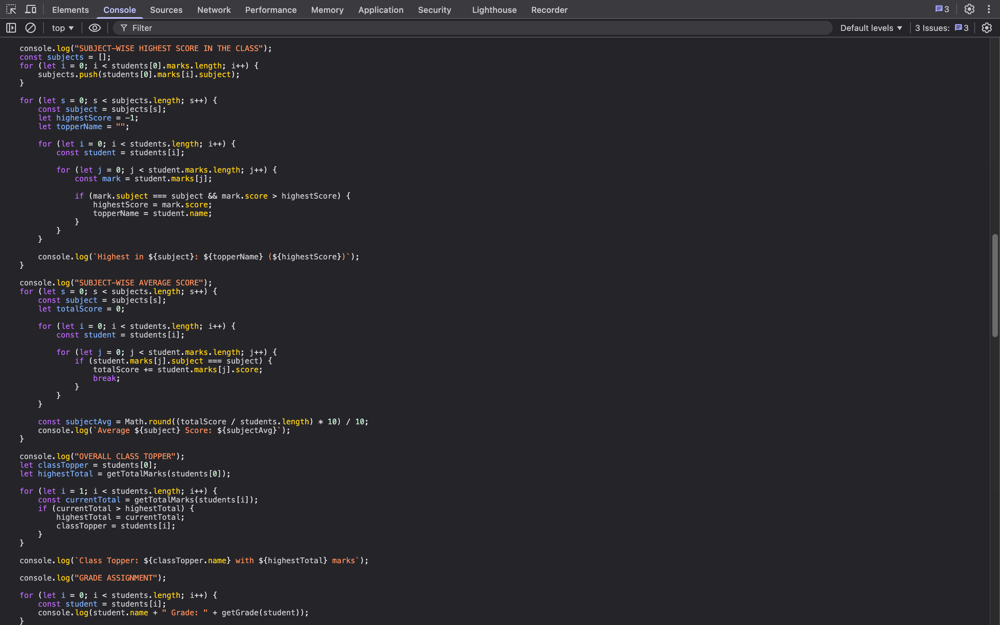

1. List of students, features including 
	1. name
	2. marks - { marks, score }
	3. attendance

2. Students specific functions
	1. `getTotalMarks()` - Sum of all the marks obtained by a student
	2. `getAverage()` - Average marks obtained by a student
	3. `getFailedSubject()` - 
	4. `getGrade()` - Grading student

3. class specific functions
	1. Subject-wise highest score in class
	2. Subject-wise average score 
	3. Overall class topper

---
## OUTPUT

