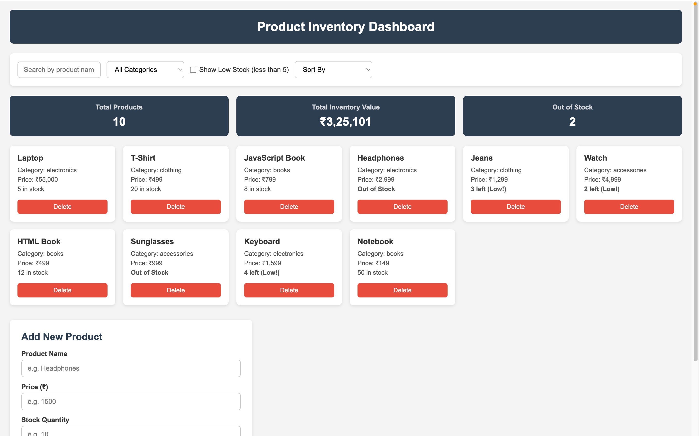
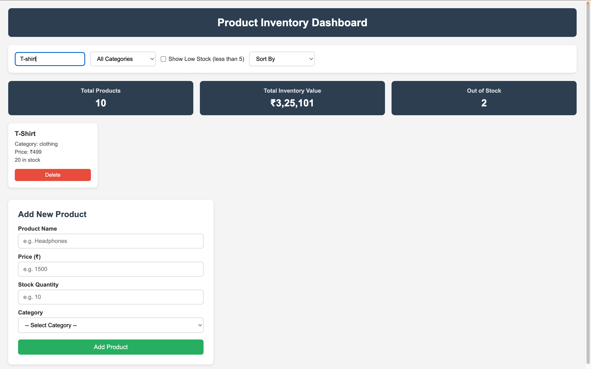
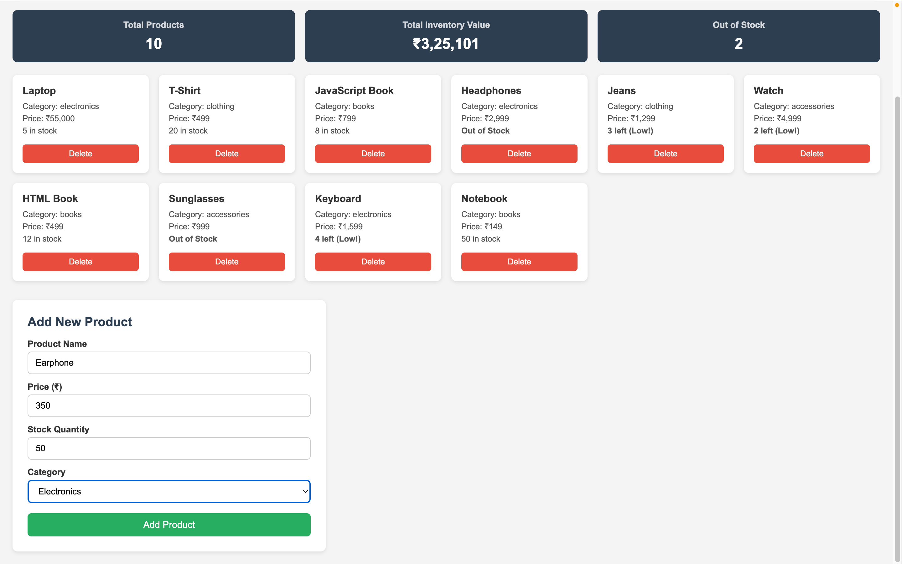

# Product Inventory Dashboard

## Project Overview
This is a Product Inventory Dashboard built using HTML, CSS, and JavaScript.

It allows users to:
- Add and delete products
- Search products instantly
- Filter by category and low stock
- Sort products by name or price
- View analytics (total products, inventory value, out-of-stock count)
- Persist data using LocalStorage

---

## Features

- Search products by name
- Filter products by category
- Show low stock products (stock < 5)
- Sort products:
	- Price: low to high / high to low
	- Name: A-Z / Z-A
- Add new product with form validation
- Delete product from inventory
- Inventory analytics dashboard
- Simulated loading state before rendering products
- Data persistence with LocalStorage

---

## Project Structure

```
mini-app/
├── index.html
├── style.css
├── script.js
├── README.md
└── screenshots/
```

---

## Technologies Used

- HTML
- CSS
- JavaScript (ES5 style)
- LocalStorage

---

## How to Run

1. Clone or download the repository.
2. Open the mini-app folder.
3. Open index.html in any browser.
4. Use the controls to search, filter, sort, add, and delete products.

---

## Screenshots






---

## Key Concepts Used

- DOM manipulation
- Event handling
- Form validation
- Array methods (filter, sort)
- Data persistence with LocalStorage
- Dynamic rendering of UI cards and analytics

---