<ol>
    <li>
        Created a database named `e_commerce`.
        <ol type="a" style="list-style-type: lower-alpha;">
            <li>Installed MYSQL using the following command:
                <pre><code>brew install mysql</code></pre>
            </li>
            <li>Started MYSQL using the following command:
                <pre><code>brew services start mysql</code></pre>
            </li>
            <li>Logged into MYSQL using the following command:
                <pre><code>mysql -u root</code></pre>
            </li>
            <li>Created a database named `e_commerce` using the following command:
                <pre><code>CREATE DATABASE e_commerce;</code></pre>
            </li>
            <li>Used the `e_commerce` database using the following command:
                <pre><code>USE e_commerce;</code></pre>
            </li>
        </ol>
        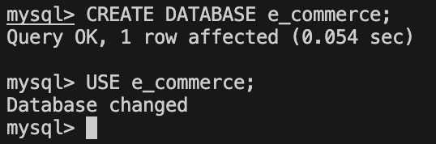
    </li>
    <li>
        Create following Tables:
        <ol type="a" style="list-style-type: lower-alpha;">
            <li>
                Created a table named `Customers` with the following columns: `customer_id`, `name`, `email`, and `mobile` using the following command:
                <pre><code>CREATE TABLE Customers (
    customer_id INT AUTO_INCREMENT PRIMARY KEY,
    name VARCHAR(50),
    email VARCHAR(50),
    mobile VARCHAR(15)
);</code></pre>
            </li>
            <li>
                Created a table named `Products` with the following columns: `id`, `name`, `description`, `price`, and `category` using the following command:
                <pre><code>CREATE TABLE Products (
    id INT,
    name VARCHAR(50) NOT NULL, 
    description VARCHAR(200),
    price DECIMAL(10, 2) NOT NULL,
    category VARCHAR(50)
);</code></pre>
                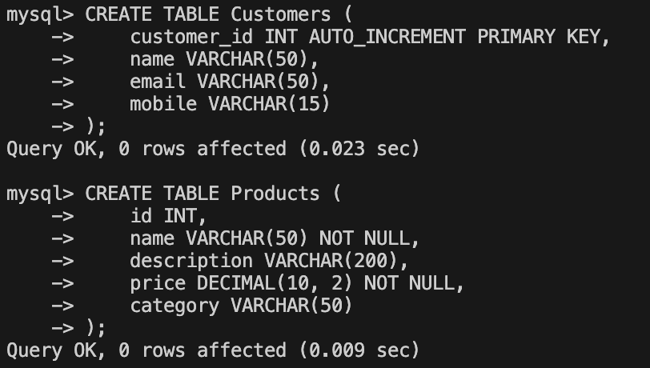
            </li>
        </ol>
    </li>
    <li>
        Modify Tables(using Alter keyword)
        <ol type="a" style="list-style-type: lower-alpha;">
            <li>
                Add not null on name and email in the Customers table
                <pre><code>ALTER TABLE Customers
MODIFY name VARCHAR(50) NOT NULL,
MODIFY email VARCHAR(50) NOT NULL;</code></pre>
            </li>
            <li>
                Add unique key on email in the Customers table
                <pre><code>ALTER TABLE Customers
MODIFY email VARCHAR(50) NOT NULL UNIQUE;</code></pre>
            </li>
            <li>
                Add column age in the Customers table
                <pre><code>ALTER TABLE Customers
ADD COLUMN age INT;</code></pre>
            </li>
            <li>
                Change column name from id to product_id in the Products table
                <pre><code>ALTER TABLE Products
CHANGE id product_id INT;</code></pre>
            </li>
            <li>
                Add primary key and auto increment on product_id in the Products table
                <pre><code>ALTER TABLE Products
MODIFY product_id INT AUTO_INCREMENT PRIMARY KEY;</code></pre>
            </li>
            <li>
                Change datatype of description from varchar to text in the Products table
                <pre><code>ALTER TABLE Products
MODIFY description TEXT;</code></pre>
            </li>
        </ol>
        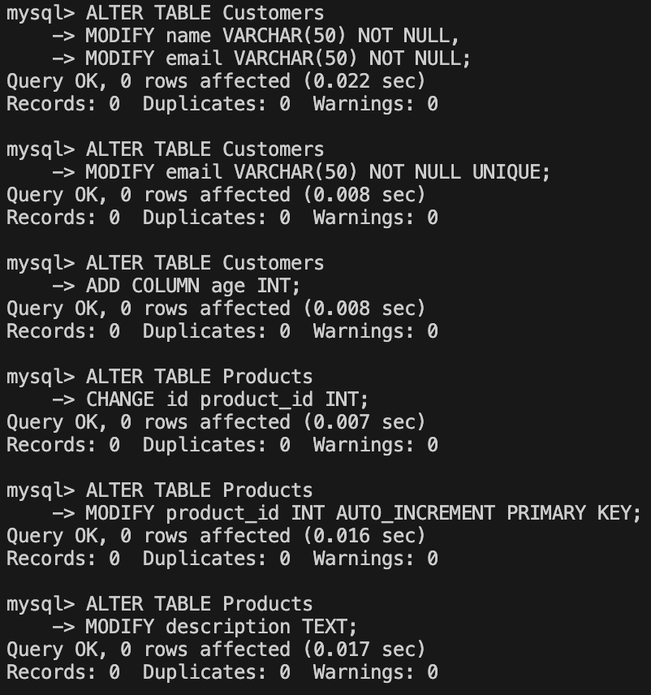
    </li>
    <li>
        Create table Order:
         
        Created a table named `Orders` with the following columns: `order_id`, `customer_id`, `product_id`, `quantity`, `order_date`, `status`, `payment_method`, and `total_amount` using the following command:
        <pre><code>CREATE TABLE Orders (
    order_id INT AUTO_INCREMENT PRIMARY KEY,
    customer_id INT,
    product_id INT NOT NULL,
    quantity INT NOT NULL,
    order_date DATE NOT NULL,
    status ENUM('Pending', 'Success', 'Cancel'),
    payment_method ENUM('Credit', 'Debit', 'UPI'),
    total_amount DECIMAL(10, 2) NOT NULL,
    FOREIGN KEY (customer_id) REFERENCES Customers(customer_id)
);</code></pre>
        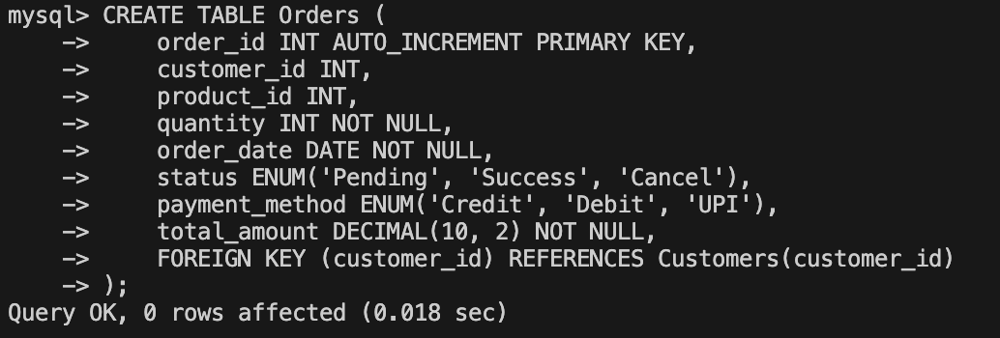
        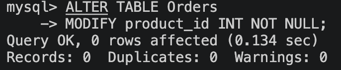
    </li>
    <li>
        Modify Orders Table(using Alter keyword):
        <ol type="a" style="list-style-type: lower-alpha;">
            <li>
                Change table name Order -> Orders
                <pre><code>As Order is a reserved keyword in SQL, we need to change the table name to Orders at the time of creation.</code></pre>
            </li>
            <li>
                Set default value pending in status
                <pre><code>ALTER TABLE Orders 
MODIFY status ENUM('Pending', 'Success', 'Cancel') NOT NULL DEFAULT 'Pending';</code></pre>
            </li>
            <li>
                Modify payment_method ENUM to add one more value: 'COD'
                <pre><code>ALTER TABLE Orders
MODIFY payment_method ENUM('Credit', 'Debit', 'UPI', 'COD');</code></pre>
            </li>
            <li>
                Make product id as foreign key
                <pre><code>ALTER TABLE Orders
ADD FOREIGN KEY (product_id) REFERENCES Products(product_id);</code></pre>
            </li>
        </ol>
        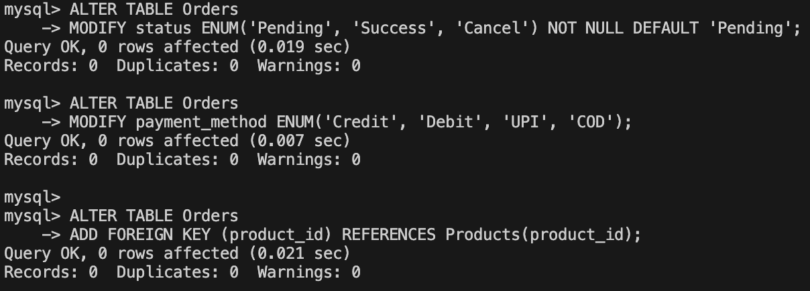
    </li>
    <li>
        Insert 20 sample records in all the tables.
        <ol type="a" style="list-style-type: lower-alpha;">
            <li>
                Insert 20 records in Customers table
        <pre><code>INSERT INTO Customers (name, email, mobile, age) VALUES
('Aarav Sharma', 'aarav.sharma@example.com', '9876500001', 24),
('Diya Verma', 'diya.verma@example.com', '9876500002', 27),
('Rohan Mehta', 'rohan.mehta@example.com', '9876500003', 31),
('Isha Patel', 'isha.patel@example.com', '9876500004', 22),
('Kabir Singh', 'kabir.singh@example.com', '9876500005', 29),
('Anaya Gupta', 'anaya.gupta@example.com', '9876500006', 26),
('Vivaan Nair', 'vivaan.nair@example.com', '9876500007', 33),
('Myra Joshi', 'myra.joshi@example.com', '9876500008', 25),
('Arjun Rao', 'arjun.rao@example.com', '9876500009', 30),
('Sara Khan', 'sara.khan@example.com', '9876500010', 28),
('Reyansh Das', 'reyansh.das@example.com', '9876500011', 35),
('Kiara Iyer', 'kiara.iyer@example.com', '9876500012', 23),
('Aditya Kulkarni', 'aditya.kulkarni@example.com', '9876500013', 32),
('Meera Bhat', 'meera.bhat@example.com', '9876500014', 21),
('Yuvraj Chawla', 'yuvraj.chawla@example.com', '9876500015', 34),
('Tara Malhotra', 'tara.malhotra@example.com', '9876500016', 29),
('Nikhil Arora', 'nikhil.arora@example.com', '9876500017', 27),
('Riya Kapoor', 'riya.kapoor@example.com', '9876500018', 24),
('Dev Mishra', 'dev.mishra@example.com', '9876500019', 36),
('Pooja Saini', 'pooja.saini@example.com', '9876500020', 26);</code></pre>
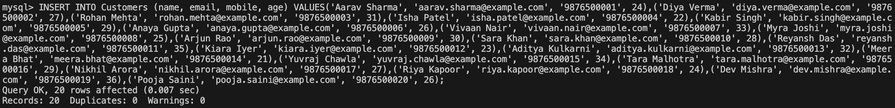
            </li>
            <li>
                Insert 20 records in Products table
<pre><code>INSERT INTO Products (name, description, price, category) VALUES
('Wireless Mouse', 'Ergonomic wireless mouse with USB receiver', 799.00, 'Electronics'),
('Mechanical Keyboard', 'RGB backlit mechanical keyboard', 2499.00, 'Electronics'),
('Bluetooth Speaker', 'Portable 10W Bluetooth speaker', 1599.00, 'Electronics'),
('Running Shoes', 'Lightweight running shoes for daily training', 2999.00, 'Footwear'),
('Denim Jacket', 'Classic fit blue denim jacket', 1999.00, 'Fashion'),
('Smart Watch', 'Fitness smartwatch with heart rate monitor', 3499.00, 'Electronics'),
('Water Bottle', 'Insulated stainless steel water bottle', 499.00, 'Home'),
('Backpack', '25L travel backpack with laptop compartment', 1299.00, 'Accessories'),
('Notebook Set', 'Pack of 5 ruled notebooks', 299.00, 'Stationery'),
('Office Chair', 'Adjustable ergonomic office chair', 5999.00, 'Furniture'),
('LED Desk Lamp', 'Touch control desk lamp with 3 brightness levels', 899.00, 'Home'),
('Yoga Mat', 'Non-slip yoga mat 6mm thickness', 699.00, 'Fitness'),
('Gaming Headset', 'Over-ear gaming headset with mic', 459.00, 'Electronics'),
('Power Bank', '10000mAh fast charging power bank', 499.00, 'Electronics'),
('Coffee Mug', 'Ceramic coffee mug 350ml', 249.00, 'Kitchen'),
('Phone Case', 'Shockproof mobile phone case', 399.00, 'Accessories'),
('USB-C Cable', '1 meter braided USB-C charging cable', 199.00, 'Electronics'),
('Study Table', 'Engineered wood compact study table', 4499.00, 'Furniture'),
('Face Wash', 'Gentle daily face wash 150ml', 299.00, 'Personal Care'),
('Sunglasses', 'UV protected polarized sunglasses', 1199.00, 'Fashion');</code></pre>
                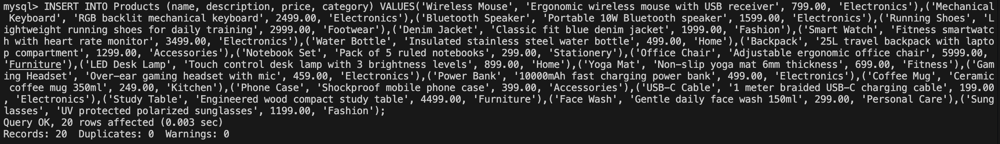
            </li>
            <li>
                Insert 20 records in Orders table
<pre><code>INSERT INTO Orders (customer_id, product_id, quantity, order_date, status, payment_method, total_amount) VALUES
(1, 1, 2, '2026-03-01', 'Success', 'UPI', 1598.00),
(2, 2, 1, '2026-03-01', 'Pending', 'Credit', 2499.00),
(3, 3, 1, '2026-03-02', 'Success', 'Debit', 1599.00),
(4, 4, 1, '2026-03-02', 'Cancel', 'COD', 2999.00),
(5, 5, 2, '2026-03-03', 'Success', 'Credit', 3998.00),
(6, 6, 1, '2026-03-03', 'Pending', 'UPI', 3499.00),
(7, 7, 3, '2026-03-04', 'Success', 'COD', 1497.00),
(8, 8, 1, '2026-03-04', 'Success', 'Debit', 1299.00),
(9, 9, 4, '2026-03-05', 'Pending', 'UPI', 1196.00),
(10, 10, 1, '2026-03-05', 'Success', 'Credit', 5999.00),
(11, 11, 2, '2026-03-06', 'Success', 'COD', 1798.00),
(12, 12, 1, '2026-03-06', 'Cancel', 'UPI', 699.00),
(13, 13, 1, '2026-03-07', 'Success', 'Debit', 459.00),
(14, 14, 2, '2026-03-07', 'Pending', 'Credit', 998.00),
(15, 15, 3, '2026-03-08', 'Success', 'UPI', 747.00),
(3, 2, 1, '2026-03-09', 'Success', 'Credit', 2499.00),
(7, 1, 1, '2026-03-09', 'Pending', 'UPI', 799.00),
(10, 6, 1, '2026-03-10', 'Success', 'Debit', 3499.00),
(12, 3, 2, '2026-03-10', 'Pending', 'COD', 3198.00),
(15, 7, 1, '2026-03-10', 'Success', 'UPI', 499.00);</code></pre>
                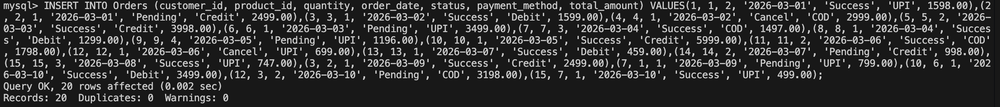
            </li>
        </ol>
    </li>
    <li>
        Perform following queries:
        <ol type="a" style="list-style-type: lower-alpha;">
            <li>Count the number of products as product_count in each category.
            <pre><code>SELECT p.category, COUNT(*) 
AS product_count
FROM Products p
GROUP BY p.category;</code></pre>
                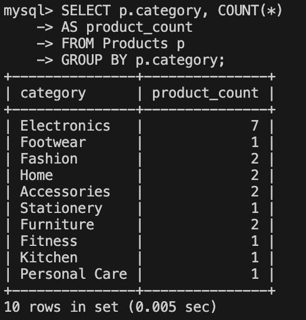
            </li>
            <li>Retrieve all products that belong to the 'Electronics' category, have a price between $50 and $500, and whose name contains the letter 'a'.
            <pre><code>SELECT * 
FROM Products
WHERE category = 'Electronics'
    AND price BETWEEN 50 AND 500
    AND LOWER(name) LIKE '%a%';</code></pre>
                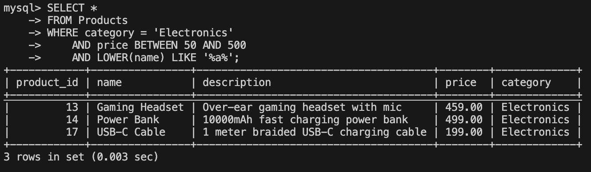
            </li>
            <li>Get the top 5 most expensive products in the 'Electronics' category, skipping the first 2.
            <pre><code>SELECT *
FROM Products
WHERE category = 'Electronics'
ORDER BY price DESC
LIMIT 5
OFFSET 2;</code></pre>
                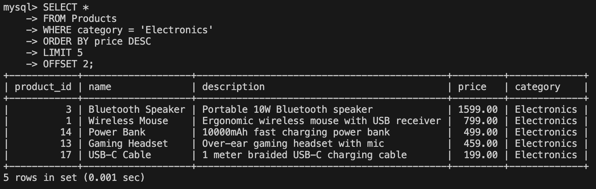
            </li>
            <li>Retrieve customers who have not placed any orders.
            <pre><code>SELECT c.customer_id, c.name
FROM Customers c
WHERE NOT EXISTS (
    SELECT 1
    FROM Orders o
    WHERE o.customer_id = c.customer_id
);</code></pre>
                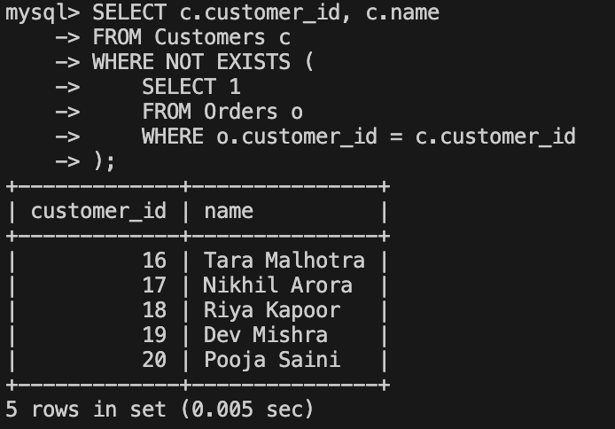
            </li>
            <li>Find the average total amount spent by each customer.
            <pre><code>SELECT c.customer_id,
       COALESCE(AVG(o.total_amount), 0) AS average_total_amount
FROM Customers c
LEFT JOIN Orders o ON o.customer_id = c.customer_id
GROUP BY c.customer_id;</code></pre>
                    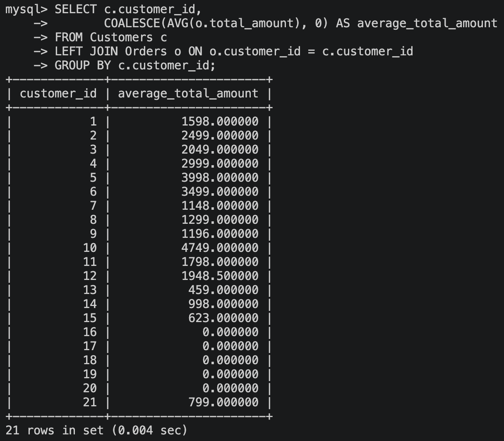
            </li>
            <li>Get the products that have a price less than the average price of all products.
            <pre><code>SELECT p.name, p.price
FROM Products p
WHERE p.price < (SELECT AVG(price) FROM Products);</code></pre>
                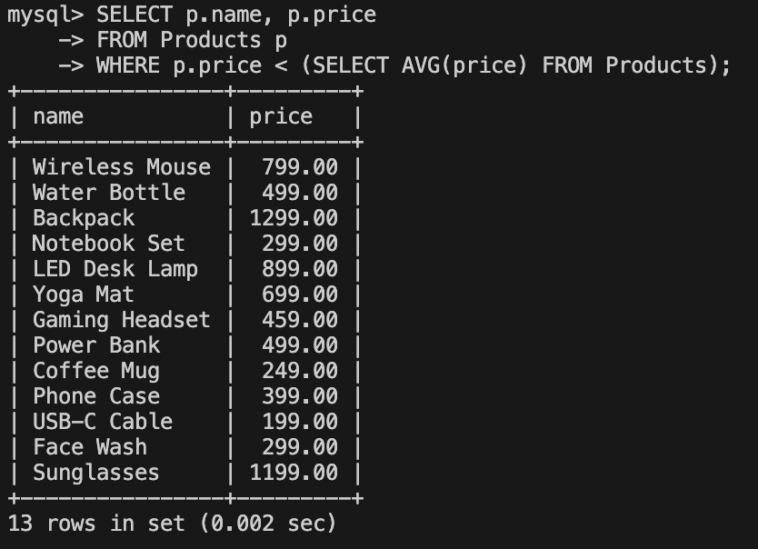
            </li>
            <li>Calculate the total quantity of products ordered by each customer.
            <pre><code>SELECT c.customer_id,
       COALESCE(SUM(o.quantity), 0) AS total_quantity
FROM Customers c
LEFT JOIN Orders o ON o.customer_id = c.customer_id
GROUP BY c.customer_id;</code></pre>
                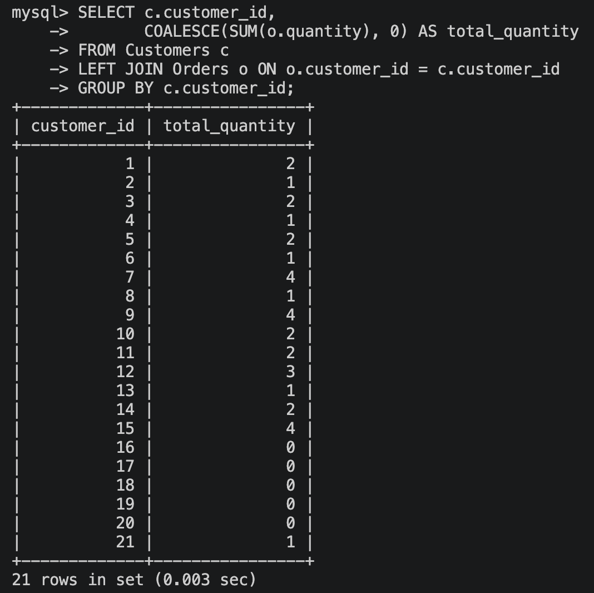
            </li>
            <li>List all orders along with customer name and product name.
            <pre><code>SELECT  o.order_id,
        c.name AS CustomerName, 
        p.name AS ProductName, 
        o.quantity, 
        o.order_date, 
        o.status, 
        o.payment_method, 
        o.total_amount
FROM Orders o
JOIN Customers c ON o.customer_id = c.customer_id
JOIN Products p ON o.product_id = p.product_id
ORDER BY o.order_id, p.name;</code></pre>
                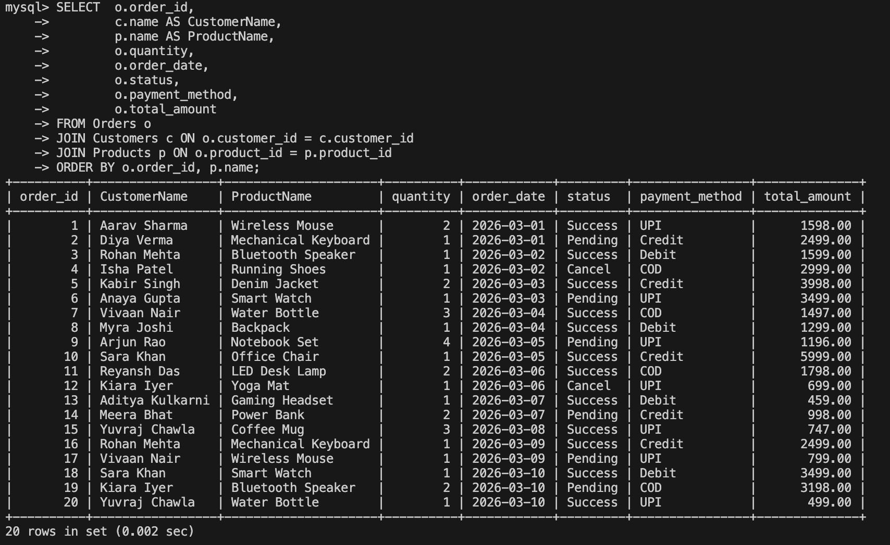
            </li>
            <li>Find products that have never been ordered.
            <pre><code>SELECT 
    p.product_id,
    p.name,
    p.price,
    p.category
FROM Products p
WHERE NOT EXISTS (
    SELECT 1
    FROM Orders o
    WHERE o.product_id = p.product_id
);</code></pre>
                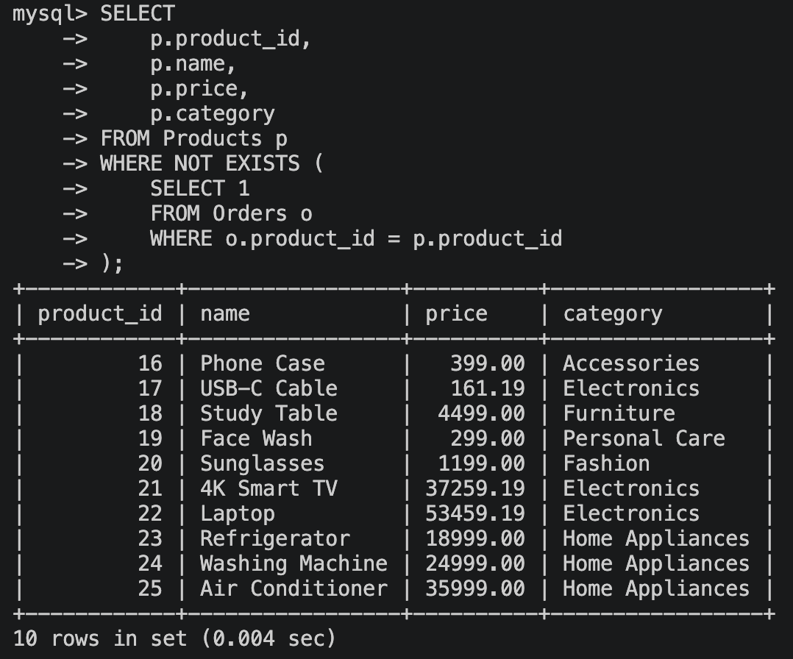
            </li>
        </ol>
    </li>
</ol>