<title>Intermediate SQL Assignment 1 - Query Documentation</title>
<h1>Intermediate SQL Assignment 1 - Query Documentation</h1>
<h2>Overview</h2>

This document provides a comprehensive breakdown of all SQL queries in <code>intermediateAssignment-1.sql</code>. The file contains 17 queries (labeled a through q) that demonstrate intermediate to advanced SQL concepts including subqueries, stored procedures, triggers, and NULL handling functions.

<h2>Database Tables Used</h2>
<ul>
<li><strong>products</strong>: Contains product_id, name, price, category</li>
<li><strong>Customers</strong>: Contains customer_id, name, email, mobile, total_spending</li>
<li><strong>Orders</strong>: Contains order_id, customer_id, product_id, quantity, order_date, total_amount, discount</li>
</ul>

<h2>Query Breakdown</h2>

<ol>
<li>
<strong>Query A: Products Above Category Average (Subquery)</strong>

<strong>Purpose:</strong> Find products priced higher than the average price in their category, ordered by category ascending and price descending.

<strong>Key Concepts:</strong>

<ul>
<li>Subquery in WHERE clause</li>
<li>Self-join using table aliases</li>
<li>ORDER BY with multiple columns</li>
</ul>
<pre><code>SELECT  product_id,
name,
price,
category
FROM products p1
WHERE price > (
SELECT AVG(price)
FROM products p2
WHERE p2.category = p1.category
)
ORDER BY category ASC, price DESC;</code></pre>
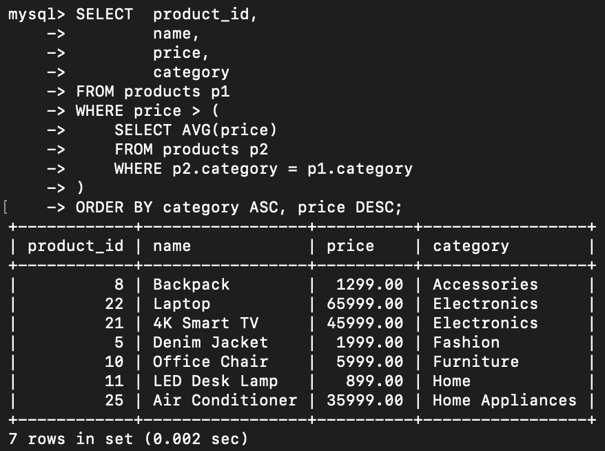
</li>

<li>
<strong>Query B: Products More Expensive Than Any Furniture Item (Subquery)</strong>

<strong>Purpose:</strong> Get all products that are more expensive than the maximum price of any 'Furniture' category product.

<strong>Key Concepts:</strong>

<ul>
<li>Subquery with MAX aggregate function</li>
<li>Category-specific filtering</li>
<li>Comparison with aggregated value</li>
</ul>
<pre><code>SELECT  product_id,
name,
price,
category
FROM products p1
WHERE price > (
SELECT MAX(price)
FROM products p2
WHERE p2.category = 'Furniture'
);</code></pre>
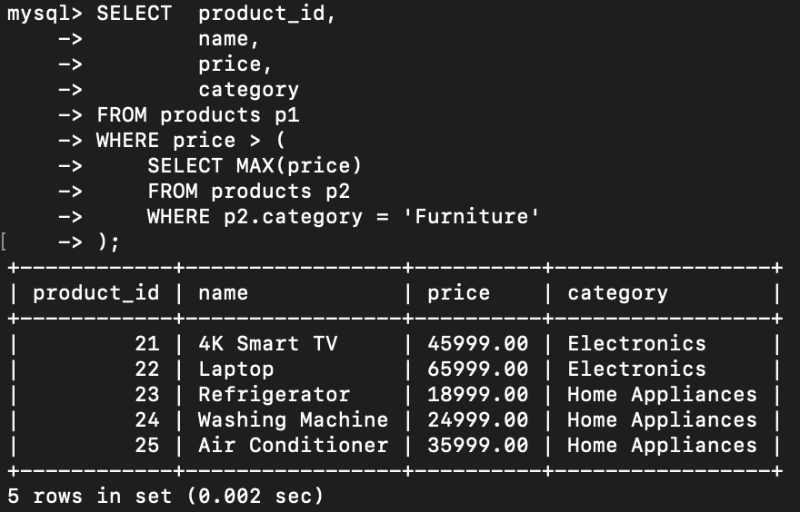
</li>

<li>
<strong>Query C: Stored Procedure - Apply Category Discount</strong>

<strong>Purpose:</strong> Create a reusable stored procedure that applies a discount percentage to all products in a specific category.

<strong>Key Concepts:</strong>

<ul>
<li>DELIMITER usage for stored procedures</li>
<li>Parameters (IN): category_name, discount_percentage</li>
<li>UPDATE statement with calculated values</li>
<li>Formula: <code>price = price - ((discount_percentage * price) / 100)</code></li>
</ul>

<strong>Usage:</strong> <code>CALL ApplyCategoryDiscount('Electronics', 10);</code>

<pre><code>DELIMITER //
CREATE PROCEDURE ApplyCategoryDiscount(IN category_name VARCHAR(255), IN discount_percentage DECIMAL(5,2))
BEGIN
UPDATE products
SET price = price - ((discount_percentage * price) / 100)
WHERE category = category_name;
END //
DELIMITER ;</code></pre>
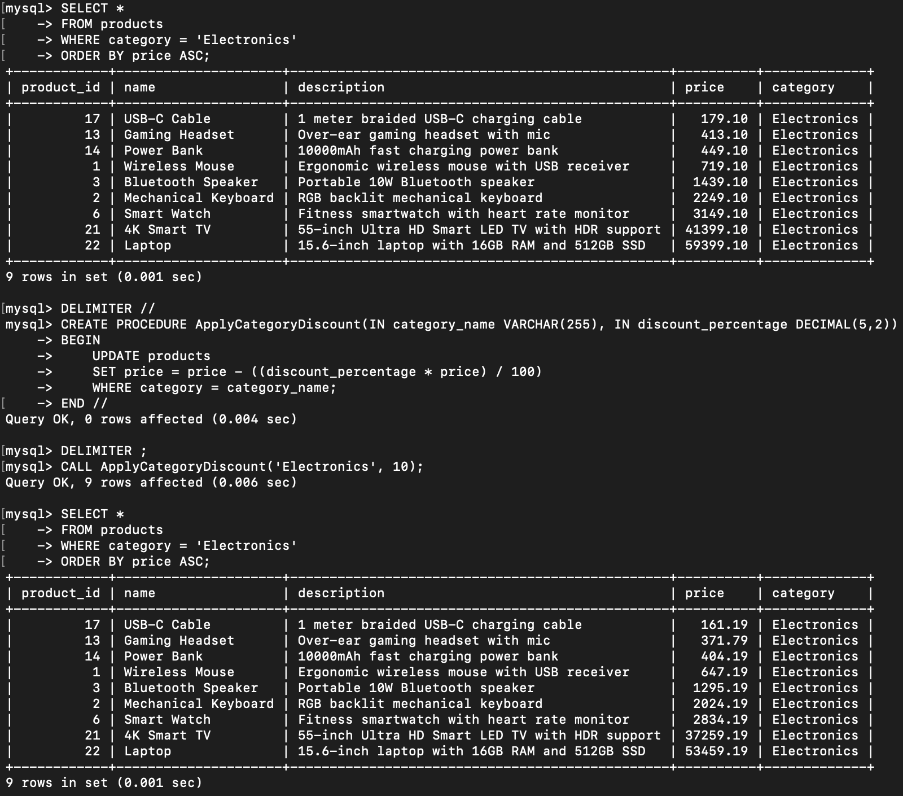
</li>

<li>
<strong>Query D: Trigger - Update Customer Total Spending</strong>

<strong>Purpose:</strong> Automatically update a customer's total spending whenever a new order is placed.

<strong>Operations:</strong>

<ol type="a">
<li>Add <code>total_spending</code> column to Customers table</li>
<li>Initialize existing customer spending from past orders using COALESCE</li>
<li>Create trigger <code>AfterOrderInsert</code> that fires after each new order insert</li>
<li>Trigger updates total_spending by adding the new order's total_amount</li>
</ol>

<strong>Key Concepts:</strong>

<ul>
<li>TRIGGER with AFTER INSERT event</li>
<li>NEW keyword to reference newly inserted values</li>
<li>Automatic data synchronization</li>
</ul>
<pre><code>ALTER TABLE Customers
ADD COLUMN total_spending DECIMAL(10,2)
DEFAULT 0.00;

UPDATE Customers c
SET total_spending = ( 
SELECT COALESCE(SUM(total_amount), 0)
FROM Orders o
WHERE o.customer_id = c.customer_id
);

DELIMITER //

CREATE TRIGGER AfterOrderInsert
AFTER INSERT ON Orders
FOR EACH ROW
BEGIN
UPDATE Customers
SET total_spending = total_spending + NEW.total_amount
WHERE customer_id = NEW.customer_id;
END //

DELIMITER ;</code></pre>
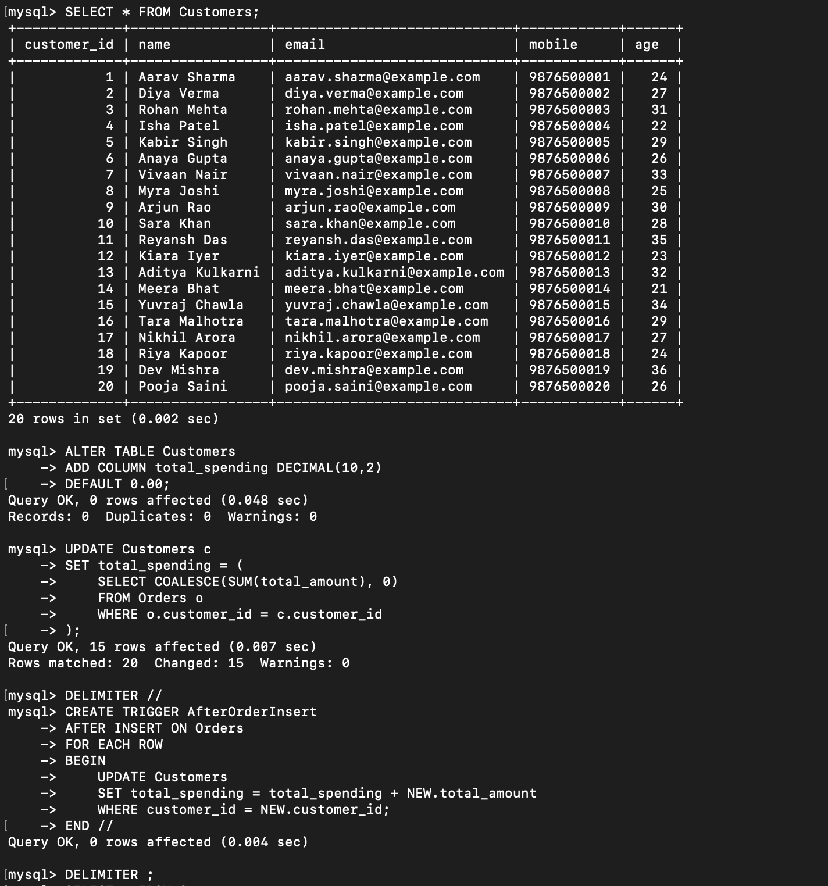
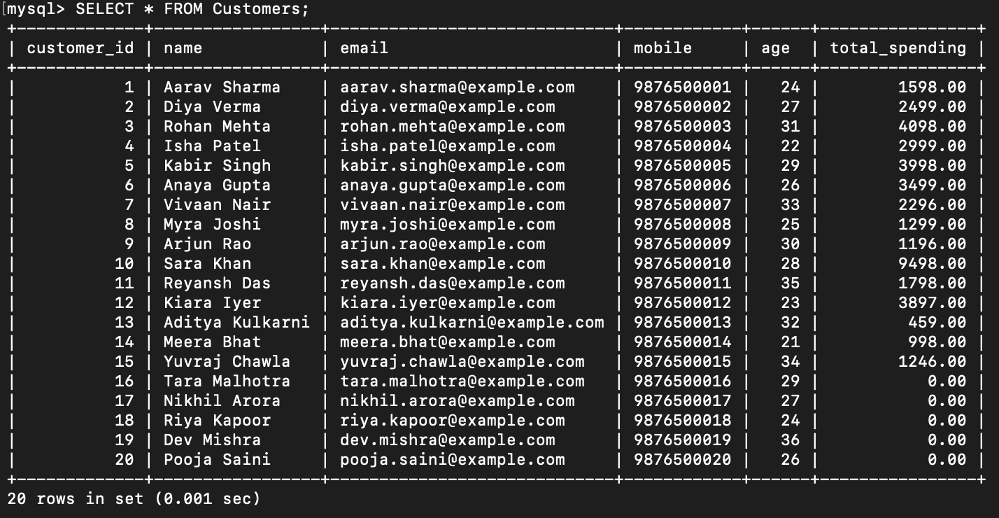
</li>

<li>
<strong>Query E: Customers with Latest Order Details (COALESCE)</strong>

<strong>Purpose:</strong> Retrieve all customers with their latest order information. Show "No orders placed" if no orders exist.

<strong>Key Concepts:</strong>

<ul>
<li>COALESCE function for NULL handling</li>
<li>Correlated subquery with ORDER BY DESC and LIMIT 1</li>
<li>CONCAT function for string formatting</li>
<li>Default text when no orders exist</li>
</ul>
<pre><code>SELECT * , COALESCE((
SELECT CONCAT('Order ID: ', o.order_id, ', Product ID: ', o.product_id, ', Quantity: ', o.quantity, ', Order Date: ', o.order_date)
FROM Orders o
WHERE o.customer_id = c.customer_id
ORDER BY order_date DESC
LIMIT 1
), 'No orders placed') AS OrderDetails
FROM Customers c
ORDER BY c.customer_id;</code></pre>
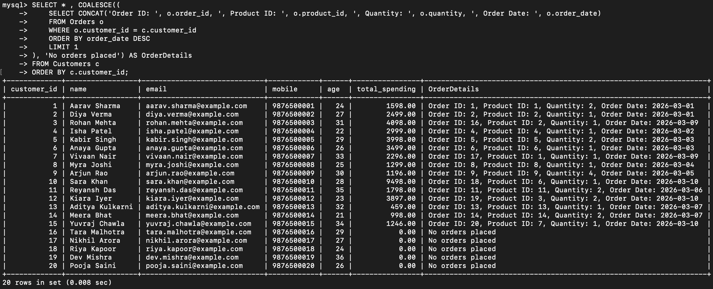
</li>

<li>
<strong>Query F: Customers with Duplicate Email/Mobile (CASE)</strong>

<strong>Purpose:</strong> Find customers whose email and mobile number are the same. Return NULL for duplicate values instead of showing them.

<strong>Key Concepts:</strong>

<ul>
<li>CASE statement for conditional logic</li>
<li>NULL return when values match</li>
<li>Data quality check</li>
</ul>
<pre><code>SELECT 
customer_id,
name,
CASE
WHEN email = mobile THEN NULL
ELSE email
END AS email,
CASE
WHEN email = mobile THEN NULL
ELSE mobile
END AS mobile
FROM Customers;</code></pre>
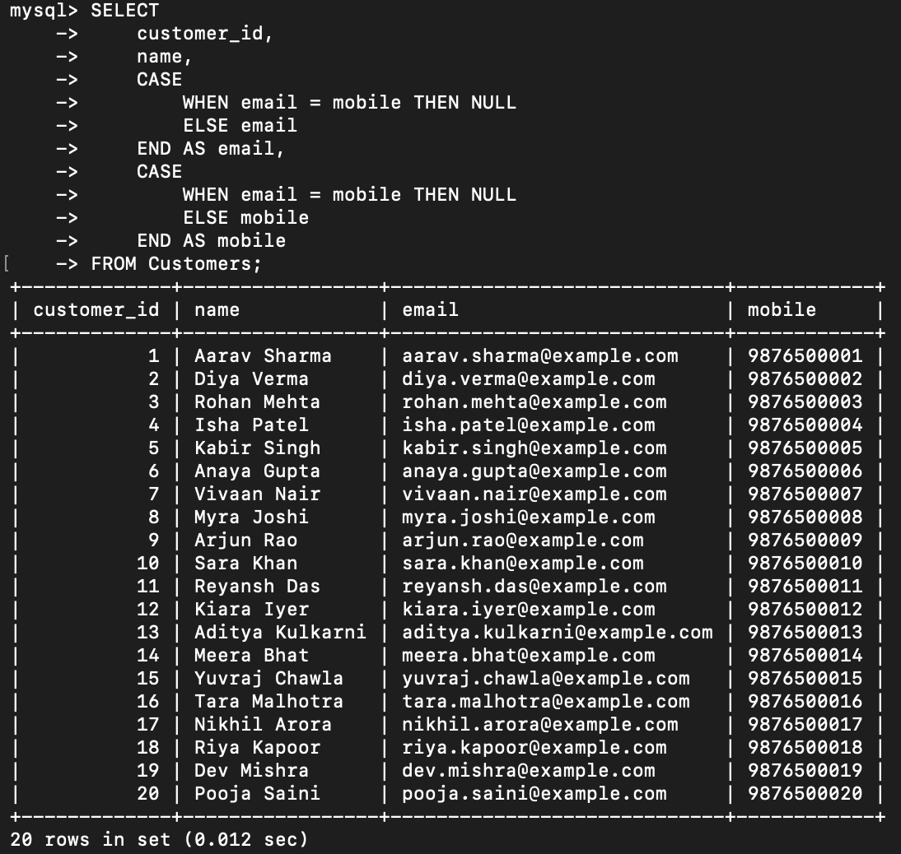
</li>

<li>
<strong>Query G: Categorize Orders by Total Amount (CASE)</strong>

<strong>Purpose:</strong> Classify all orders into three value categories:

<ul>
<li>Low Value: Less than $100</li>
<li>Medium Value: $100 - $500</li>
<li>High Value: More than $500</li>
</ul>

<strong>Key Concepts:</strong>

<ul>
<li>CASE statement with multiple conditions</li>
<li>BETWEEN operator for range checking</li>
<li>Business logic implementation</li>
</ul>
<pre><code>SELECT  
order_id,
total_amount,
CASE 
WHEN total_amount < 100 THEN 'Low Value'
WHEN total_amount BETWEEN 100 AND 500 THEN 'Medium Value'
ELSE 'High Value'
END AS order_category
FROM Orders;</code></pre>
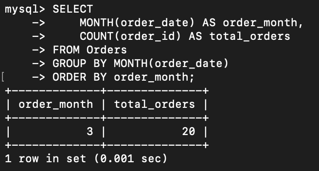
</li>

<li>
<strong>Query H: Count Orders Per Month (GROUP BY, Date Functions)</strong>

<strong>Purpose:</strong> Find the total number of orders placed in each month.

<strong>Key Concepts:</strong>

<ul>
<li>MONTH() date function to extract month from order_date</li>
<li>GROUP BY for aggregation</li>
<li>COUNT aggregate function</li>
<li>Ordering results chronologically</li>
</ul>
<pre><code>SELECT 
MONTH(order_date) AS order_month,
COUNT(order_id) AS total_orders
FROM Orders
GROUP BY MONTH(order_date)
ORDER BY order_month;</code></pre>
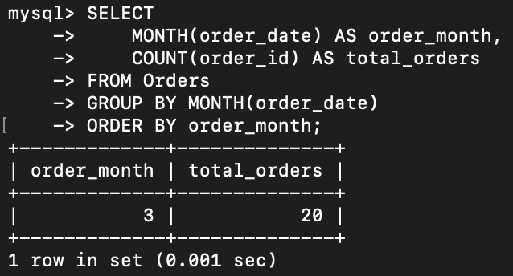
</li>

<li>
<strong>Query I: Replace Zero Values with NULL in Discount Column</strong>

<strong>Purpose:</strong> Alter Orders table to add a discount column, then display discount values with zeros converted to NULL.

<strong>Operations:</strong>

<ol type="a">
<li>Add discount column with default value 0.00</li>
<li>Use CASE statement to convert 0 to NULL in query results</li>
</ol>

<strong>Key Concepts:</strong>

<ul>
<li>CASE for conditional value replacement</li>
<li>NULL vs 0 distinction</li>
</ul>
<pre><code>ALTER TABLE Orders
ADD COLUMN discount DECIMAL(10,2)
DEFAULT 0.00;

SELECT 
order_id,
total_amount,
CASE 
WHEN discount = 0 THEN NULL 
ELSE discount 
END AS discount
FROM Orders;</code></pre>
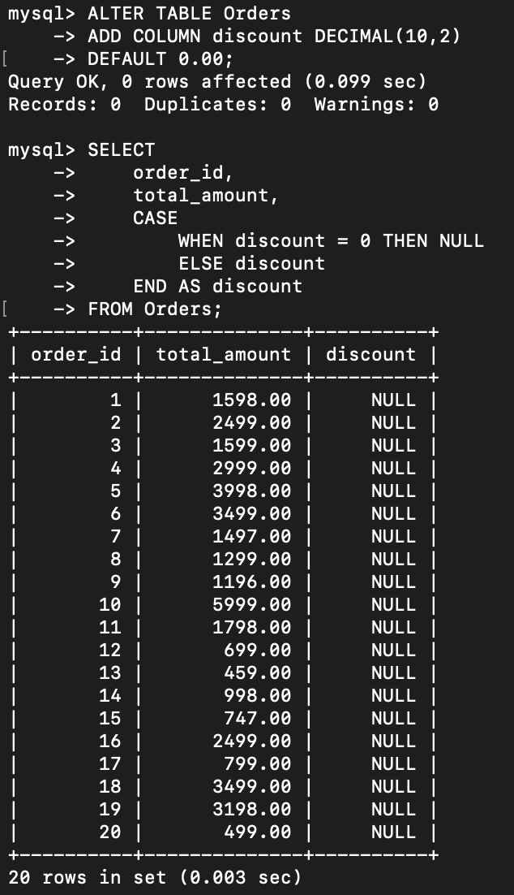
</li>

<li>
<strong>Query J: Calculate Price Per Piece Avoiding Division by Zero</strong>

<strong>Purpose:</strong> Calculate price per piece by dividing total_amount by quantity, safely handling cases where quantity is 0.

<strong>Key Concepts:</strong>

<ul>
<li>Division by zero prevention using CASE</li>
<li>NULL return when division would be invalid</li>
<li>Safe arithmetic operations</li>
</ul>
<pre><code>SELECT 
product_id,
quantity,
total_amount,
CASE
WHEN quantity = 0 THEN NULL
ELSE total_amount / quantity
END AS price_per_piece
FROM Orders;</code></pre>
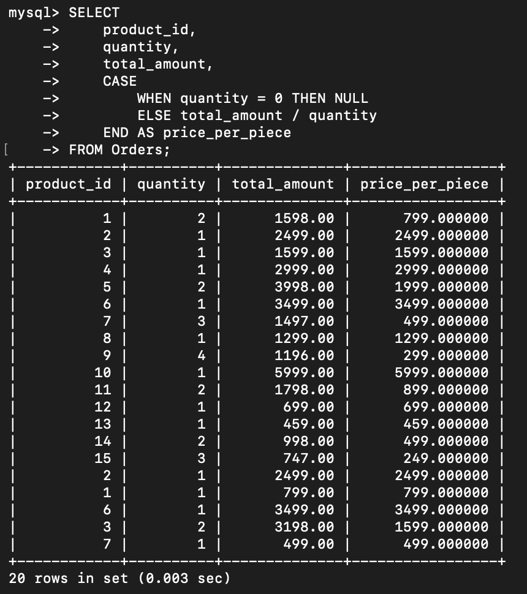
</li>

<li>
<strong>Query K: Count Non-Zero Score Values (NULLIF in Aggregation)</strong>

<strong>Purpose:</strong> Count how many score values are non-zero in table XYZ.

<strong>Key Concepts:</strong>

<ul>
<li>NULLIF function converts 0 to NULL</li>
<li>COUNT ignores NULL values</li>
<li>Aggregate function optimization</li>
</ul>
<pre><code>SELECT COUNT(NULLIF(score, 0)) AS non_zero_score_count
FROM XYZ;</code></pre>
</li>

<li>
<strong>Query L: Average Salary Excluding Zeros (NULLIF with AVG)</strong>

<strong>Purpose:</strong> Calculate average salary from employees table, excluding rows where salary = 0.

<strong>Key Concepts:</strong>

<ul>
<li>NULLIF(salary, 0) converts 0 values to NULL</li>
<li>AVG aggregate function ignores NULL values</li>
<li>Data quality filtering</li>
</ul>
<pre><code>SELECT AVG(NULLIF(salary, 0)) AS average_salary
FROM employees;</code></pre>
</li>

<li>
<strong>Query M: Percentage Contribution with Safe Division (COALESCE + NULLIF)</strong>

<strong>Purpose:</strong> Calculate each row's percentage contribution (value / total_value) safely handling cases where total is zero.

<strong>Key Concepts:</strong>

<ul>
<li>NULLIF returns NULL when SUM equals 0</li>
<li>COALESCE replaces NULL with 1 for safe division</li>
<li>Combined NULL handling functions</li>
</ul>
<pre><code>SELECT value/COALESCE(NULLIF(SUM(total_value), 0), 1) AS percentage_contribution
FROM XYZ;</code></pre>
</li>

<li>
<strong>Query N: Convert Empty Strings to NULL (NULLIF)</strong>

<strong>Purpose:</strong> Display customer emails as NULL when they are empty strings.

<strong>Key Concepts:</strong>

<ul>
<li>NULLIF handles empty string conversion</li>
<li>Data normalization</li>
<li>Distinguishing between '' and NULL</li>
</ul>
<pre><code>SELECT 
customer_id,
name,
NULLIF(email, '') AS email
FROM Customers;</code></pre>
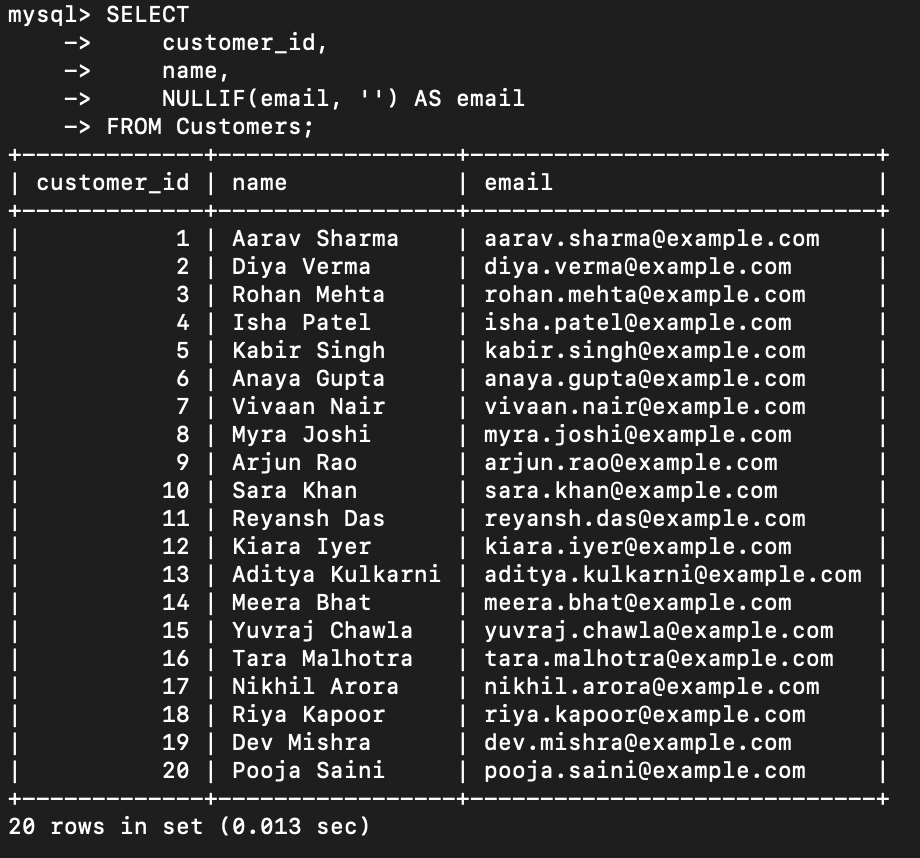
</li>

<li>
<strong>Query O: Identify Matching Date Columns (NULLIF)</strong>

<strong>Purpose:</strong> Identify rows where start_date and end_date are equal, returning NULL when they match.

<strong>Key Concepts:</strong>

<ul>
<li>NULLIF for column comparison</li>
<li>Date matching detection</li>
<li>Data validation</li>
</ul>
<pre><code>SELECT *, NULLIF(start_date, end_date) AS same_dates
FROM XYZ;</code></pre>
</li>

<li>
<strong>Query P: Aggregate Ignoring Specific Values (NULLIF in Aggregation)</strong>

<strong>Purpose:</strong> Calculate average of column 'a' while excluding rows where value equals -1.

<strong>Key Concepts:</strong>

<ul>
<li>NULLIF converts -1 to NULL</li>
<li>AVG ignores NULL values</li>
<li>Filtering aggregation without WHERE clause</li>
</ul>
<pre><code>SELECT AVG(NULLIF(a, -1))
FROM xyz;</code></pre>
</li>

<li>
<strong>Query Q: Replace Value When Columns Match (NULLIF + CASE)</strong>

<strong>Purpose:</strong> When val1 matches val2, return their sum; otherwise return 0.

<strong>Key Concepts:</strong>

<ul>
<li>NULLIF comparison for matching values</li>
<li>Combined NULLIF and CASE logic</li>
<li>Conditional value transformation</li>
</ul>
<pre><code>SELECT 
val1,
val2,
CASE 
WHEN NULLIF(val1, val2) = NULL THEN val1 + val2
ELSE 0
END AS modified_value
FROM xyz;</code></pre>
</li>
</ol>