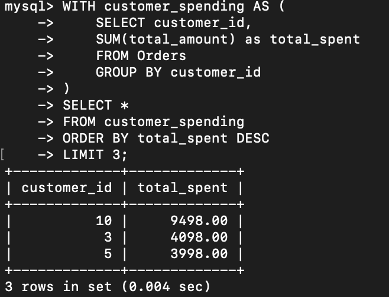
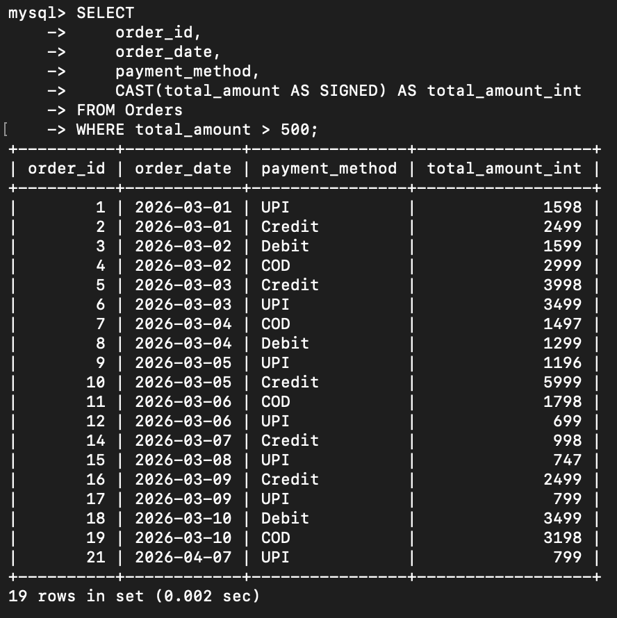
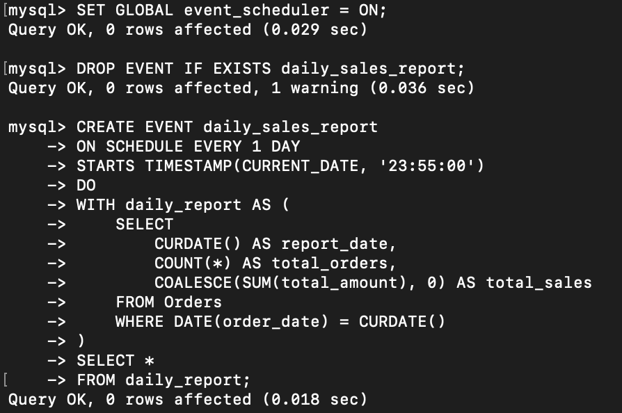
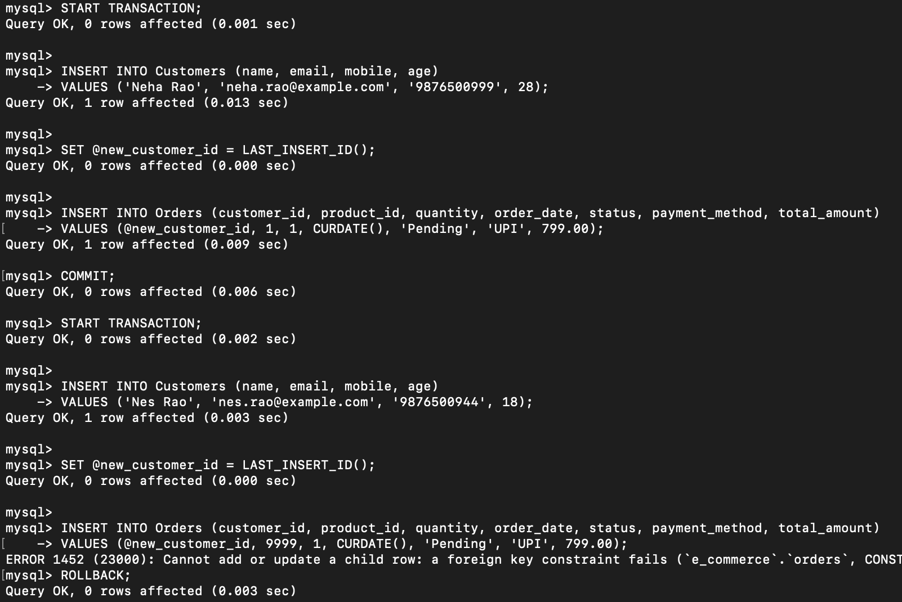
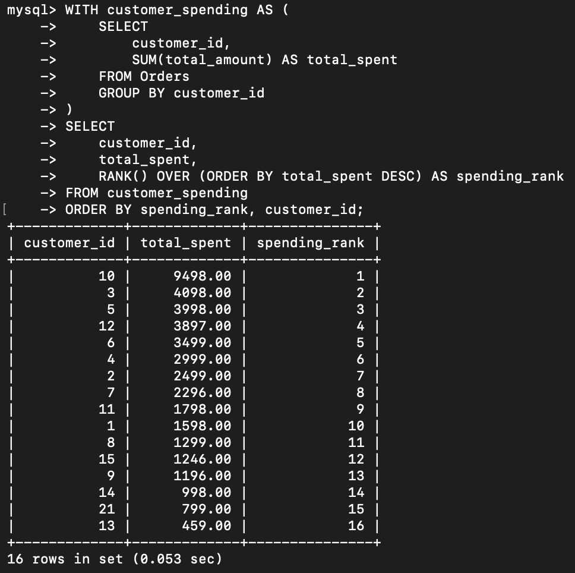

<title>Intermediate SQL Assignment 2 - Query Documentation</title>
<h1>Intermediate SQL Assignment 2 - Query Documentation</h1>

<h2>Overview</h2>

This document provides a breakdown of the SQL queries in <code>intermediateAssignment-2.sql</code>. The file contains five tasks that demonstrate Common Table Expressions (CTEs), type casting, cron scheduling, transactions, and window functions.

<h2>Database Tables Used</h2>
<ul>
<li><strong>Customers</strong>: Stores customer details such as customer_id, name, email, mobile, and age</li>
<li><strong>Products</strong>: Stores product details such as product_id, name, description, price, and category</li>
<li><strong>Orders</strong>: Stores order details such as order_id, customer_id, product_id, quantity, order_date, status, payment_method, and total_amount</li>
</ul>

<h2>Query Breakdown</h2>

<ol>
<li>
<strong>Query A: Top 3 Customers by Total Spending Using a CTE</strong>

<strong>Purpose:</strong> Find the three customers who have spent the most across all orders.

<strong>Key Concepts:</strong>

<ul>
<li>Common Table Expression (CTE)</li>
<li>SUM aggregation</li>
<li>ORDER BY with LIMIT</li>
</ul>
<pre><code>WITH customer_spending AS (
	SELECT customer_id,
	SUM(total_amount) as total_spent
	FROM Orders
	GROUP BY customer_id
)
SELECT *
FROM customer_spending 
ORDER BY total_spent DESC
LIMIT 3;</code></pre>

</li>

<li>
<strong>Query B: Orders Above 500 with CAST</strong>

<strong>Purpose:</strong> Retrieve orders whose total amount exceeds 500 and display the amount as an integer.

<strong>Key Concepts:</strong>

<ul>
<li>CAST for type conversion</li>
<li>Filtering numeric values with WHERE</li>
<li>Column aliasing</li>
</ul>
<pre><code>SELECT 
	order_id, 
	order_date, 
	payment_method, 
	CAST(total_amount AS SIGNED) AS total_amount_int
FROM Orders
WHERE total_amount > 500;</code></pre>

</li>

<li>
<strong>Query C: Cron Job for Daily Sales Report</strong>

<strong>Purpose:</strong> Schedule a daily report generation job at 11:55 PM.

<strong>Key Concepts:</strong>

<ul>
<li>Cron expression format</li>
<li>Daily scheduling</li>
<li>Time-based automation</li>
</ul>

<strong>Cron Syntax:</strong>

<pre><code>SET GLOBAL event_scheduler = ON;

DROP EVENT IF EXISTS daily_sales_report;

CREATE EVENT daily_sales_report
ON SCHEDULE EVERY 1 DAY
STARTS TIMESTAMP(CURRENT_DATE, '23:55:00')
DO
WITH daily_report AS (
    SELECT
        CURDATE() AS report_date,
        COUNT(*) AS total_orders,
        COALESCE(SUM(total_amount), 0) AS total_sales
    FROM Orders
    WHERE DATE(order_date) = CURDATE()
)
SELECT *
FROM daily_report;</code></pre>

This schedule runs every day at 11:55 PM.

</li>

<li>
<strong>Query D: Transaction to Insert a Customer and an Order</strong>

<strong>Purpose:</strong> Insert a new customer and then place an order for that customer inside a transaction.

<strong>Key Concepts:</strong>

<ul>
<li>START TRANSACTION and COMMIT</li>
<li>LAST_INSERT_ID to capture the new customer key</li>
<li>Rollback logic if the order insert fails</li>
</ul>
<pre><code>START TRANSACTION;

INSERT INTO Customers (name, email, mobile, age)
VALUES ('Nes Rao', 'nes.rao@example.com', '9876500944', 18);

SET @new_customer_id = LAST_INSERT_ID();

INSERT INTO Orders (customer_id, product_id, quantity, order_date, status, payment_method, total_amount)
VALUES (@new_customer_id, 9999, 1, CURDATE(), 'Pending', 'UPI', 799.00);

COMMIT;

-- If the order INSERT fails, execute:
-- ROLLBACK;</code></pre>

<strong>Note:</strong> In a real database session, the rollback must be executed before COMMIT if the second insert fails.

</li>

<li>
<strong>Query E: Rank Customers by Total Spending</strong>

<strong>Purpose:</strong> Rank customers according to their total spending, while preserving ties with the same rank.

<strong>Key Concepts:</strong>

<ul>
<li>Window function: RANK()</li>
<li>CTE for pre-aggregation</li>
<li>Sorting by rank and customer_id</li>
</ul>
<pre><code>WITH customer_spending AS (
	SELECT
		customer_id,
		SUM(total_amount) AS total_spent
	FROM Orders
	GROUP BY customer_id
)
SELECT
	customer_id,
	total_spent,
	RANK() OVER (ORDER BY total_spent DESC) AS spending_rank
FROM customer_spending
ORDER BY spending_rank, customer_id;</code></pre>

</li>
</ol>

<h2>Summary</h2>

This assignment covers practical advanced SQL concepts including aggregation with CTEs, type conversion, cron scheduling, transactional control, and ranking with window functions.

