# Basic Java

1. Write a program to calculate the area of a circle, rectangle, or triangle based on user input.
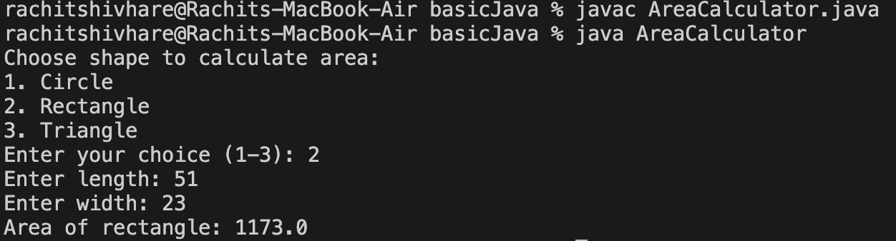
2. Create a program to check if a number is even or odd.
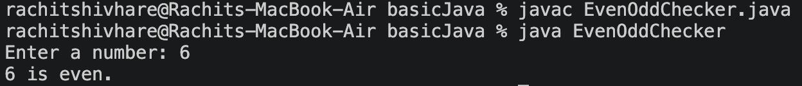
3. Implement a program to find the factorial of a given number.
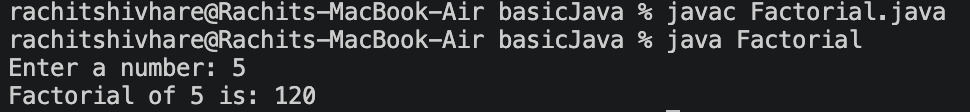
4. Write a program to print the Fibonacci sequence up to a specified number.
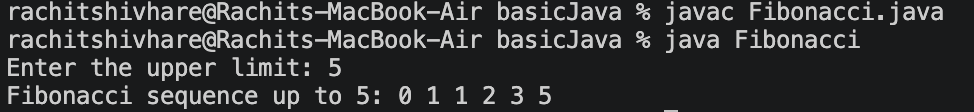
5. Use loops to print patterns like a triangle or square.
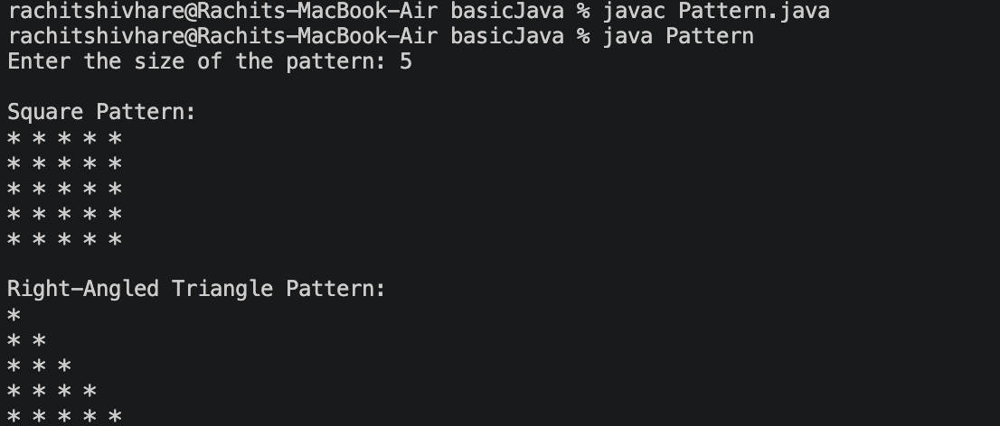

# Data Types and Operators

1. Explain the difference between primitive and reference data types with examples.

2. Write a program to demonstrate the use of arithmetic, logical, and relational operators.
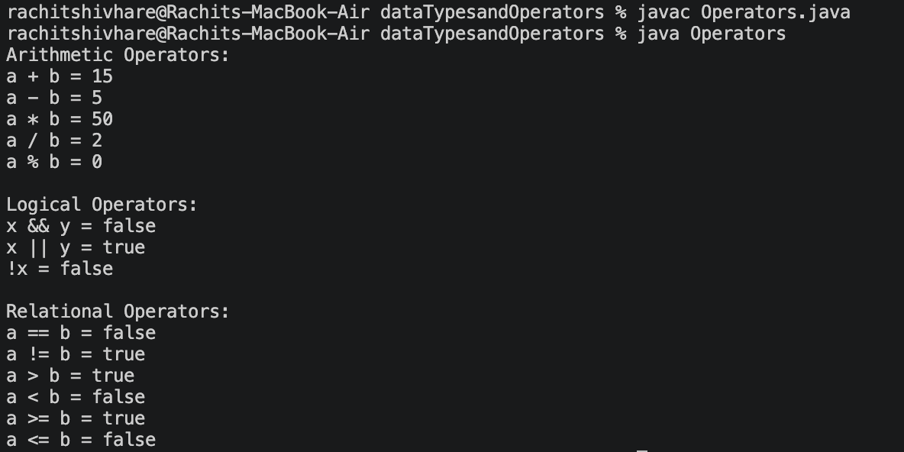
3. Create a program to convert a temperature from Celsius to Fahrenheit and vice versa.
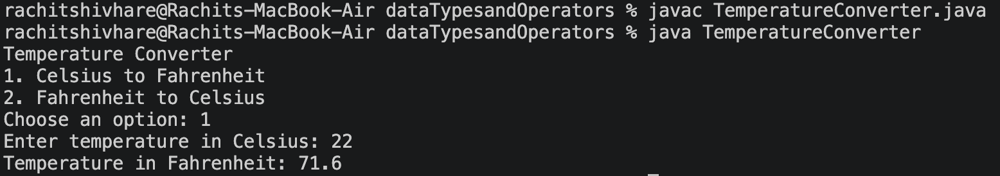

# Control Flow Statements

1. Write a program to check if a given number is prime using an if-else statement.
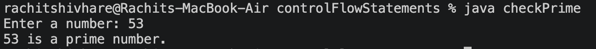
2. Implement a program to find the largest number among three given numbers using a conditional statement.
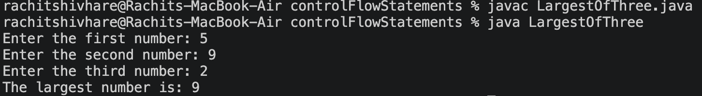
3. Use a for loop to print a multiplication table.
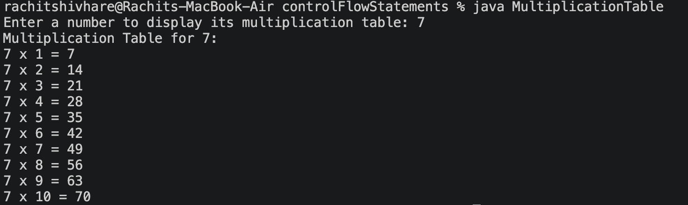
4. Create a program to calculate the sum of even numbers from 1 to 10 using a while loop.
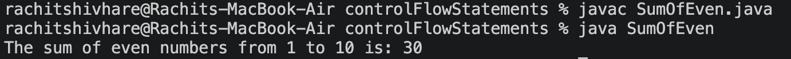

# Arrays

1. Write a program to find the average of elements in an array.
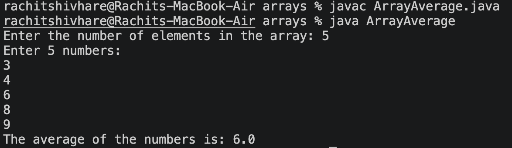
2. Implement a function to sort an array in ascending order using bubble sort or selection sort.
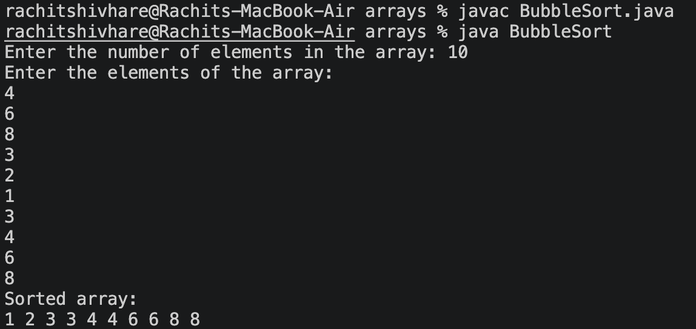
3. Create a program to search for a specific element within an array using linear search.
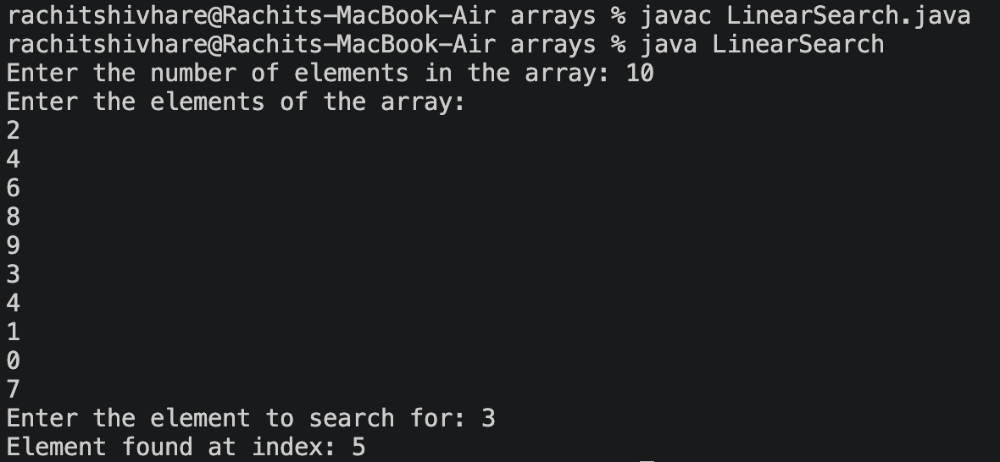

# Object Oriented Programming (OOP)

Create a class to represent a student with attributes like name, roll number, and marks. Implement inheritance to create a "GraduateStudent" class that extends the "Student" class with additional features. Demonstrate polymorphism by creating methods with the same name but different parameters in a parent and child class. Explain the concept of encapsulation with a suitable example.
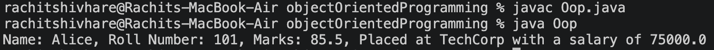

# String Manipulation

1. Write a program to reverse a given string.
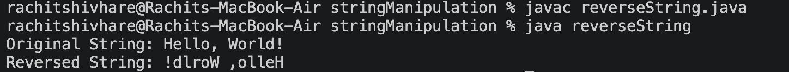
2. Implement a function to count the number of vowels in a string.
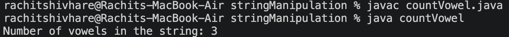
3. Create a program to check if two strings are anagrams.
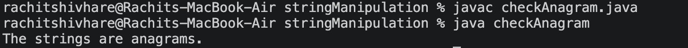

# Advanced Topics

1. Explain the concept of interfaces and abstract classes with examples.

2. Create a program to handle exceptions using try-catch blocks.
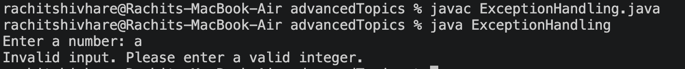
3. Implement a simple file I/O operation to read data from a text file.
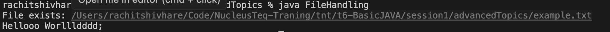
4. Explore multithreading in Java to perform multiple tasks concurrently.
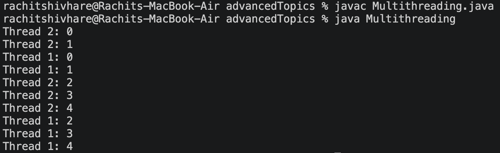